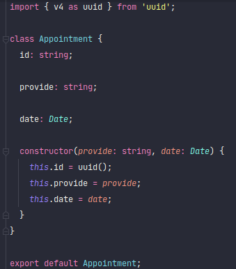
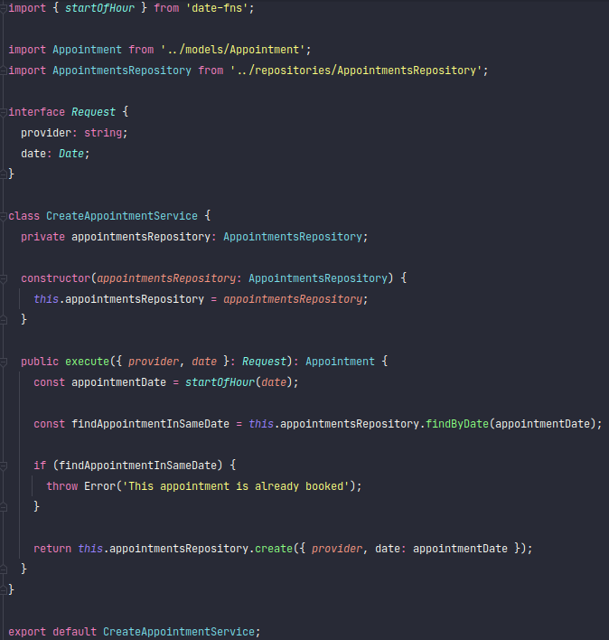

<h1 align="center">Api Node.js com TypeScript do GoBarber</h1>

## Tecnologias

- [ESLint e Prettier](https://www.notion.so/ESLint-e-Prettier-Trilha-Node-js-d3f3ef576e7f45dfbbde5c25fa662779)
- [Express](https://expressjs.com/)
- [TypeScript](https://www.typescriptlang.org/)
- [date-fns](https://date-fns.org/)
- [TypeORM](https://typeorm.io/)
- [docker](https://www.docker.com/)
- [JWT](https://jwt.io/)
- [TSyringe](https://github.com/microsoft/tsyringe)
- [jestjs](https://jestjs.io/)
- [Handlebars](https://handlebarsjs.com/)
- [Celebrate](https://github.com/arb/celebrate)
- [Class Transformer](https://github.com/typestack/class-transformer)

---

## Requisitos e Regras de negócio

- **RF**: Requisitos Funcionais;
- **RNF**: Requisitos Não Funcionais;
- **RN**: Regras de negócio.

### Recuperação de senha

#### RF

- [x] O usuário deve poder recuperar a sua senha informando o seu e-mail;
- [x] O usuário deve receber um e-mail com instruções de recuperação de senha;
- [x] O usuário deve poder resetar a sua senha.

#### RNF

- [x] Utilizar Ethereal para testar envios em ambiente de desenvolvimento;
- [ ] Utilizar Amazon SES para envios em ambiente de produção;
- [ ] O envia de e-mail deve acontecer em segundo plano (_background job_);

#### RN

- [x] O token enviado por email para resetar a senha, deve expirar em 2h;
- [ ] O usuário confirma a nova senha ao registrá-la;

### Atualização do perfil

#### RF

- [x] O usuário deve poder atualizar o seu nome, email e senha.

#### RN

- [x] O usuário não pode alterar o e-mail para um que esteja em uso;
- [x] Para atualizar a senha é necessário informar a senha antiga;
- [ ] Para atualizar a senha é necessário confirmar a nova senha.

### Painel do prestador

#### RF

- [x] O usuário deve ser capaz de listar os seus agendamentos de um dia específico;
- [ ] O prestador deve receber uma notificação sempre que houver um novo agendamento;
- [ ] O provedor deve ser capaz de ver notificações não lidas.

#### RNF

- [ ] Os agendamentos do prestador no dia devem ser armazenadas em cache;
- [ ] As notificações do prestador devem ser armazenadas no MongoDB;
- [ ] As notificações do prestador devem ser enviadas em tempo-real utilizando Socket.oi.

#### RN

- [ ] A notificação deve ter o status de lida ou não-lida para que o prestador possa controlar.

### Agendamento de serviços

#### RF

- [x] O usuário deve ser capaz de listar todos os provedores de serviços registrados;
- [x] O usuário deve ser capaz de listar os dias de um mês com pelo menos um tempo disponível de um provedor;
- [x] O usuário deve ser capaz de listar os horários disponíveis num dia específico de um provedor;
- [x] O usuário deve ser capaz de realizar um novo agendamento com um prestador.

#### RNF

- [ ] A listagem de prestadores deve ser armazenada em cache.

#### RN

- [x] Cada agendamento deve durar 1h exatamente;
- [x] O usuário não pode agendar num horário já ocupado;
- [x] Os agendamentos devem estar disponíveis entre 8h e 18h (Primeiro às 8h, último às 17h);
- [x] O usuário não pode agendar num horário que já passou;
- [x] O usuário não pode agendar serviços consigo mesmo;

---

## Docker

### Postgres

```
docker run --name gobarber_db -e POSTGRES_PASSWORD=docker -e POSTGRES_USER=docker -p 5432:5432 -d postgres
```

### MongoDB

```
docker run --name mongo_db -p 27017:27017 -d -t mongo
```


---

## Metodologia

### DDD

[Domain-Driven Design](https://medium.com/spotlight-on-javascript/domain-driven-design-for-javascript-developers-9fc3f681931a)

### SOLID

[O que é SOLID: O guia completo para você entender os 5 princípios da POO](https://medium.com/desenvolvendo-com-paixao/o-que-%C3%A9-solid-o-guia-completo-para-voc%C3%AA-entender-os-5-princ%C3%ADpios-da-poo-2b937b3fc530)

---

## Estrutura

### Modelos

Representa a estrutura dos dados.



### Repositórios

É a conexão entre a persistência de dados e as rotas.


### DTO

Data Transfer Object (**DTO**) ou simplesmente Transfer Object é um padrão de projetos bastante usado para o transporte
de dados entre diferentes componentes de um sistema, diferentes instâncias ou processos de um sistema distribuído ou
diferentes sistemas via serialização.


### Rotas

Deve receber uma requisição, chama outro arquivo e devolver uma resposta.


### Services

- Lidando com regras de negócios;
- Em geral, eles só possuem um método público para executar uma tarefa;
- Não tem acesso ao `request` e `response` das rotas;
- **Dependency Inversion**: Quando precisar usar dependências externas, em vez de criar uma nova instância, ela deve ser
  passada como um parâmetro do construtor de serviço.



